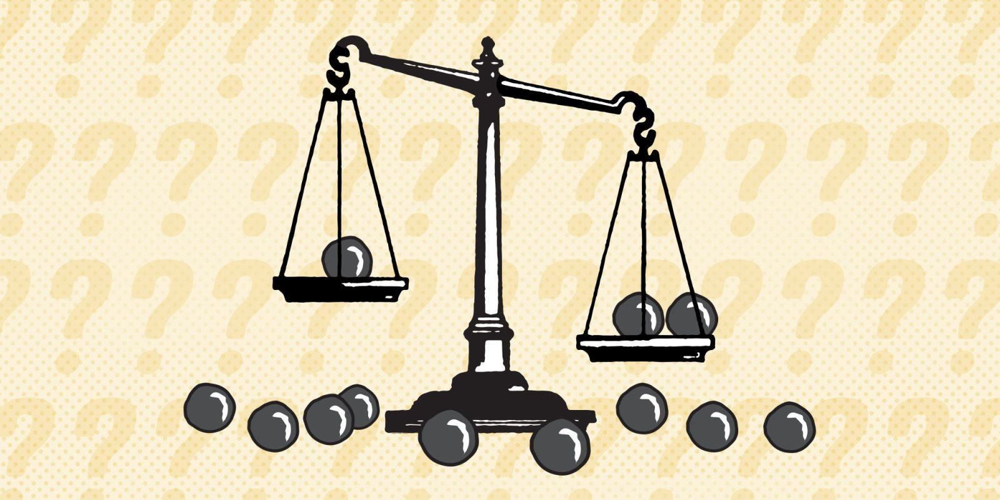
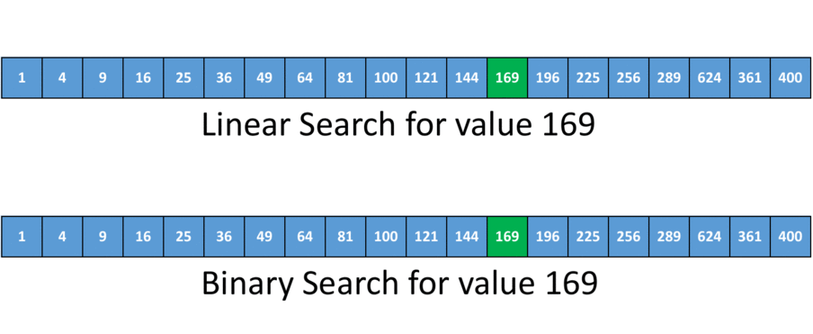

---
# Feel free to add content and custom Front Matter to this file.
# To modify the layout, see https://jekyllrb.com/docs/themes/#overriding-theme-defaults

layout: default
---

This article is a Reusable Learning Object (RLO) created specifically for INFO 101. This article may be used as an auxiliary material to teach introductory computer science algorithms, including sorting and searching.

### Introduction to Algorithms

What are algorithms and why we use them? Recall the definition to we made in class, an algorithm is simply a step-by-step process where each step must be followed precisely and be carried out in a prescribed order ending in a finite result. In other word, an algorithm is just a method we use to yield promised results and solve problems including but not limited to: 

* Sorting
* Searching
* Pattern Recognizing 
* Optimization
* …

But why we want to use algorithms, or why we prefer one algorithm over another? Well, the short answer is we want to get better results with using less time and resources. For example, you don’t want to wait minutes just for loading a webpage. And you don’t want to run out of all your computer memory just for classifying an image. Thus, different algorithms are often compared in terms of quality of results (e.g. accuracy) and resources consumed (e.g. time, memory). In this article, we will describe introductory sorting and searching algorithms and compares their performance. 

### Sorting

Sorting can help us finding an element in a list more quickly. We will show how in the next section. Before discussing sorting algorithm, let’s warm-up with a famous interview question named “heavier ball”:

> You have 7 balls. One weighs more than the others (not significantly). You have a scale. Describe how to find the heavier ball using the scale as less as possible.

The naivest way to solve this problem is compare the balls one by one until the scale become imbalanced. However, this approach will use the scale up to 6 times, which is a lot. We can definitely do better. Instead of weight the balls one by one, we now weight them 3 and 3. If the scale is equal, we ball not on the scale is the heavier one. If the scale is not equal, we just compare the heavier 1 and 1. If the scale is equal, the one not on the scale is the heavier one. If not, we find the heavier one by scale. This approach will use the scale up to 2 times. Now you see, this is the power of algorithm!

Now let’s change the problem a little bit. Instead of having only one ball with different weight, now all 7 balls can have different weight. How can we sort the balls ascendingly using the scale as less as possible? 

#### Bubble Sort

Bubble sort is one of the most straightforward algorithms to solve this problem. Bubble sorting can be viewed as repeatedly finding the maximum (or minimum) value of arrays. To use bubble sorting to solve the problem, we follow the following steps:

1. Compare the balls 1 and 1 and find the heaviest ball
2. Put the heaviest ball outside of the balls 
3. Repeat step 1 and 2 with remaining balls, until only one ball left

Note that after finishing the first repetition, we find the heaviest ball and after the second repetition, we find the second heaviest ball. After 6 repetition, we know every ball’s rank. Foe each repetition, we need to make n – 1 comparison using the scale, where n is the number of remaining balls. Thus, the total number of times we using the scale is:

$$count = 6 + 5 + 4 + 3 + 2 + 1 = 21 $$

Where bubble sorting is straightforward and easy to understand. The result is not so good. Can we do better?

#### Quick Sort

Quick sort is a more efficient algorithm and utilize the divide and conquer paradigm. Quick Sorting begin with randomly pick an element from the list as pivot and split the list as left and right sub-list based on that pivot where left are elements less than pivot and right are elements greater than pivot. Then we apply the algorithm to the sub-lists until only one element left in the sub-list, which is sorted by definition. To solve above problem using Quick Sort, we perform the following steps:

1. Randomly pick a ball as pivot. Compare all remaining balls with pivot and split the remaining balls into 2 group where left group are balls lither than pivot and right group are balls heavier than pivot. Suppose we are lucky and the pivot is the median of the balls. Now, left group has 3 balls and right group has 3 balls, and we know the position of pivot now. The number of times we using scale in this step is 6
2. For left group, randomly pick a ball as pivot and compare all remaining balls with the pivot and split the remaining balls into left-left group and left-right group. Again, suppose we picked the median of left group. Now, there is only 1 ball in both left-left group and left-right group and the left group is sorted. This step costs 6 times scale comparison
3. Repeat step 2 for right group, and the right group is sorted and this cost is again, 2. Now, all balls are sorted, the number of times we using the scale is 10, which is much better that bubble sort. 

Note that we made some assumption on the above steps. We suppose the ideal condition which is we can always pick the median of sub-lists as pivot. Adversely, if we always pick the maximum or minimum value of sub-lists, the performance is the same as bubble sort, which is the worst condition.

How quick sort achieve such improvement? Recall that in the bubble, after each comparison, the lighter ball is through back immediately to the ball pool and giving no information about the position of the lighter ball. However, in quick sort, after comparison, the algorithm “remember” the approximate, if not exact, position of each ball by putting it to either left or right group. Thus, we only need to compare the ball with other members of the same group to find its position instead of the all other balls. 

The following figures show the behavior of these tow algorithms by sorting a randomly generated array. You can enter different size to see the behavior and performance of these algorithms. Try it out!

    List size: <input type="number" name="quantity" min="20" max="100" id="arraySize" value="20" step="1">
    <input type="button" value="Go!" onclick="visualizeSorting()" id="run-sorting">

 

 

As you may found, the large the array size, the faster quick sort compare to bubble sort. Formally, we complexity of bubble sort is $$O(n^2)$$, which means the time cost of the algorithm increase quadratically  as the input size grow. And the complexity of quick sort is $$O(n\log(n))$$, which means the time cost of the algorithm increase quasilinearly as the input size grow. 

 

Figure above shows the time cost vs. array size for both sorting algorithm. Note that it will take 22 seconds to just sort a 10,000-element array using bubble sort. However, in this big data era, data usually has a scale of millions. This means that it may take days or weeks just for sorting these data using bubble sort! But luckily, quick sort can do that in a reasonable amount of time. 

### Searching

In general, we use searching algorithm to find if a value is in some list or data set. In the previous section, we show how bubble sort and quick sort work. But why do we even need to sort data? In this section, we will show that how searching algorithms work and how sorting can help accelerating searching. 

#### Linear Search

Linear search is one of the most straightforward searching algorithms. We just check every element in the list in order until the list end or we found the value. This algorithm can be applied to any list, sorted or unsorted and it requires us to go through every element in the list. Thus, the complexity of linear search, as the name imply, is linear, formally $$O(n)$$. 

#### Binary Search

Binary search is faster than linear search. However, binary search requires the list must be **sorted**. Instead of going through every element in order, binary search looks for the median of the list. Because the list is sorted, if the median is less than the target value, it cuts off all elements to the left of the median and apply another binary search in the right part of the list. Since after every search, the list size is halved, we only need to perform $$\log(n)$$ search and the algorithm complexity is $$O(\log(n))$$, where $$n$$ is the origin list size. 

The following figure shows the behavior and performance of both linear and binary search.  

The following figure shows the time cost vs. array size of both algorithms. You can find that as the input size increase, the time cost for linear search increase linearly and the time cost for binary search change rarely. One of disadvantage of binary search is that it requires a sorted list. And this is how sorting accelerate searching and why using an affordable sorting algorithm is important. 

### Conclusion

In this article, we describe introductory sorting and search algorithms and why they are important. We show that:

1. How bubble sort and quick sort work and how quick sort is faster than bubble sort
2. The complexity of bubble sort is $$O(n^2)$$ and of quick sort is $$O(n\log(n))$$. As the input size increase, the time cost of bubble sort increase significantly faster than time cost of quick sort. When sorting large data set using bubble sort is infeasible, quick sort can finish in a reasonable time
3. Linear search can be applied to any list, both sorted and unsorted, and the complexity is $$O(n)$$
4. Binary search can be applied only to sorted list. The complexity is $$O(\log(n))$$
5. By applying sorting, we can improve search speed from $$O(n)$$ to $$O(\log(n))$$

